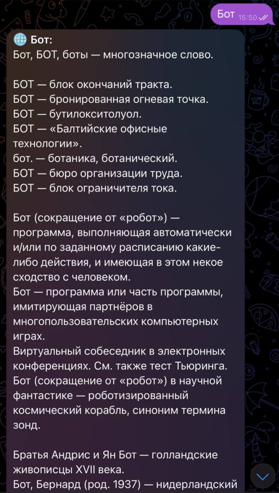

# Wikipedia Bot

## Описание

Wikipedia Bot — это чат-бот, созданный для предоставления информации из Википедии. Бот использует API Википедии для получения данных и предлагает пользователям удобный интерфейс для поиска и чтения статей.

## Функциональность

1. **Поиск информации:** Пользователи могут использовать бота для поиска статей по различным темам. Бот предоставляет краткую информацию о найденных статьях.

2. **Чтение статей:** Пользователи могут запросить полный текст статьи по интересующей их теме, и бот предоставит содержимое статьи из Википедии.

3. **Ссылки и источники:** Бот предоставляет ссылки и источники, связанные с выбранной статьей, чтобы пользователи могли глубже изучить тему.

## Инструкции по использованию

1. **Установка:**
- Клонируйте репозиторий: `git clone https://github.com/kamolgks/wikipedia_bot.git`
- Перейдите в каталог проекта: `cd wikipedia_bot`
- Установите зависимости: `pip install -r requirements.txt`

2. **Токен бота с BotFather:**
- Получите токен вашего бота в BotFather.
- Создайте файл .env в корневом каталоге вашего проекта и добавьте ваш токен бота:

```
BOT_TOKEN=''
```

3. **Запуск бота:**
- Запустите бота: `python main.py`
- Бот готов к использованию в вашем чате.

## Примеры использования




## Вклад в проект

Если вы хотите внести вклад в развитие проекта, создайте ветку, внесите изменения и отправьте запрос на слияние.

## Лицензия

Этот проект распространяется по лицензии [GNU GENERAL PUBLIC LICENSE v3.0](LICENSE). Вы свободны использовать, изменять и распространять его в соответствии с условиями лицензии.

**Спасибо за использование Wikipedia Bot!**